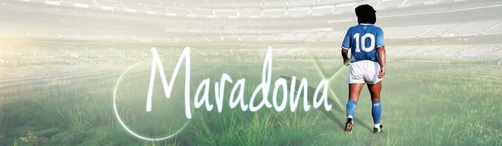

    

## 🖥️ Projeto
Maradona, um dos maiores ícones do futebol mundial, deixou uma marca indelével no esporte. Seu talento inigualável, habilidade excepcional e paixão ardente pelo jogo fizeram dele um dos jogadores mais celebrados de todos os tempos. Este site é uma homenagem a sua carreira lendária e à influência duradoura que ele teve no futebol.

## O Que Você Encontrará Aqui

- História: Explore a fascinante jornada de Maradona, desde seus humildes começos até os momentos brilhantes em campo que o consagraram como um verdadeiro ícone.

- Títulos: Descubra a lista impressionante de títulos que Maradona conquistou ao longo de sua carreira. Desde campeonatos nacionais até troféus internacionais, cada conquista é um testemunho do seu domínio no futebol.

- Estatísticas: Mergulhe nos números e nas estatísticas que ilustram a genialidade de Maradona. Descubra seus recordes, números de gols, assistências e muito mais, demonstrando sua habilidade excepcional e contribuição para o esporte.

- Vídeos: Reviva os momentos inesquecíveis e as jogadas brilhantes de Maradona assistindo a uma seleção cuidadosamente escolhida de vídeos. Veja sua destreza, técnica impecável e gols incríveis que o tornaram um verdadeiro ícone do futebol.

## Observação:
Este site é uma criação independente e não tem afiliação oficial com Diego Maradona ou sua equipe de gerenciamento. É uma homenagem de fãs para fãs.

## 🚀 Tecnologias Utilizadas
O site foi desenvolvido utilizando as seguintes tecnologias:

- ReactJS: https://react.dev/learn
- React Router Dom: https://reactrouter.com/en/main